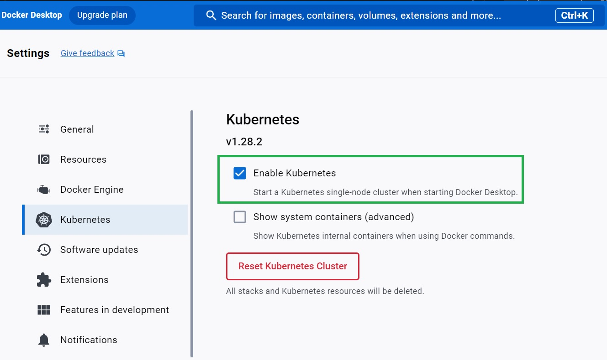
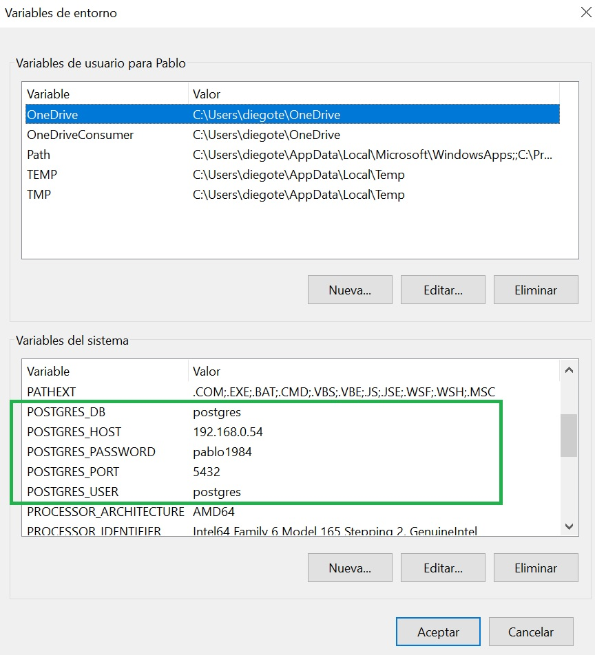

# Interviewing
Repo creado para la entrevista de Grupo Quinto Andar.

## Funcionamiento.

## Requerimientos.
Todo se realizo en mi notebook personal con windows 10. 
1. Una instancia de Postgres.
2. IntelliJ o cualquier Ide para java.
3. Gradle
4. Java 1.8 instalado 
5. Docker Desktop instalado. 
6. Registry de Docker.
   
   https://stackoverflow.com/questions/58654118/pulling-local-repository-docker-image-from-kubernete

   
      docker run -d -p 5000:5000 --restart=always --name registry registry:2

7. Habiliar kubernetes en el Docker desktop.
   
   Desde Docker Desktop:
   

## Pasos de deploy. 
1. Buildear el proyecto con la siguiente task del archivo build.gradle: 
   
   **task customFatJar**

2. Para probar la ejecucion desde la terminal, ejecutar el siguiente comando:

   
      java -jar .\csvProcessor.jar all datos.csv 10000 a "," 23

   **Recordar tener las siguientes variables de entorno configuradas: **

   

3. Buildear la imagen con Docker situados en el directorio del proyecto:

      
      docker build -t manejador_csv:v1 -f .\infra\Dockerfile .

4. Para correr la imagen de docker se hace de la siguienta manera:

      
      docker run -e FUNCION="all" -e RUTA="datos.csv" -e TOTALROWS="10000" -e LETTER="a" -e SEPARATOR="," -e TOTALLETTERS="26" -e POSTGRES_DB="postgres" -e POSTGRES_HOST="192.168.0.54" -e POSTGRES_PASSWORD="pablo1984" -e POSTGRES_PORT="5432" -e POSTGRES_USER="postgres"  manejador_csv:v1

5. Taggear y pushear al registry local de Docker Desktop:
   
   Para tener disponible las imagenes al momento de crear recursos en el cluster kubernetes que tenemos local, dembemos hacer lo siguiente. 
   
   TAGGING:

      docker tag manejador_csv:v1 localhost:5000/manejador_csv

   PUSHING

      docker push localhost:5000/manejador_csv

6. Crear cronjob en kubernetes:

      kubectl apply -f .\infra\cronjob.yaml